# Vue & Typescript

1. vue cli 버전 업데이트 하라고 뜬다면 업데이트를 해줌

> [Vue CLI](https://cli.vuejs.org/guide/installation.html)
>
> 업데이트가 되지 않는다면 `npm uninstall @vue/cli`(or `yarn remove @vue/cli`)해주고 터미널 창에 `vue`를 쳐봄.
>
> 그래도 아직 뷰가 남아있다면
>
> [npm전역설치경로](https://joshua1988.github.io/webpack-guide/build/npm-module-install.html#npm-%EC%A0%84%EC%97%AD-%EC%84%A4%EC%B9%98)
>
> ```sh
> # window
> %USERPROFILE%\AppData\Roaming\npm\node_modules
> 
> # mac
> /usr/local/lib/node_modules
> ```
>
> 여기에 들어가서 `rm -rf`(리눅스 폴더 또는 파일 삭제 명령어)
>
> ```bash
> $rm -rf @vue
> ```
>
> 이러고 다시 vue를 설치
>
> ```bash
> $ npm install -g @vue/cli
> #or
> $yarn global add @vue/cli
> ```

```bash
$ npm update -g @vue/cli
# or
$ yarn global add @vue/cli
```

2. 프로젝트 생성

> 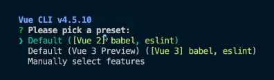
>
> 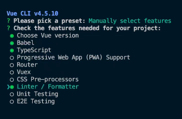
>
> 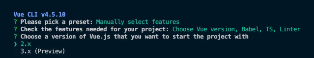
>
> 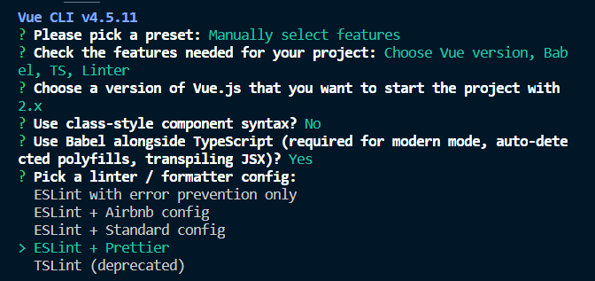
>
> 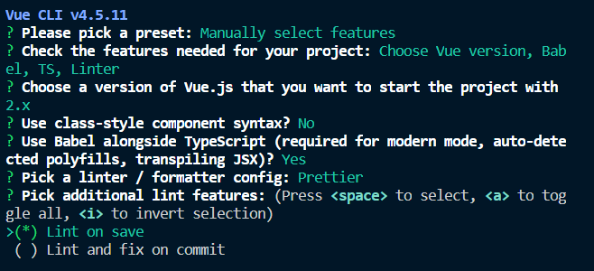
>
> 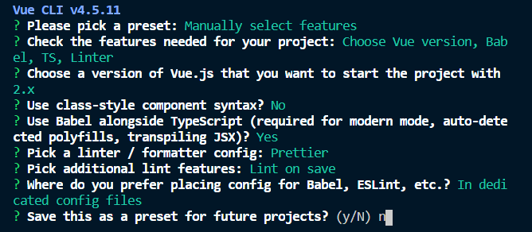
>
> - preset : 뷰 플러그인의 집합
> - 아직까진 현업에선 버전업이 안됐기 때문에 vue2로 배움
> - vue3는 project2에 할건데 typescript를 쓰기엔 더 좋아졌다
> - `In dedicated config files` : 항상 설정파일은 별도로 관리를 하는게 확장성 있게 사용할 수 있다

```bash
$ vue create vue-todo
? Please pick a preset : Manually select features #선택
- CHoose Vue version #default
- Babel #선택(default)
- TypeScript #선택 -> Vue는 Typescript를 직접구현보다 프로젝트 생성 시 Typescript선택
- Progressive Web App (PWA) Support
- Router
- Vuex
- CSS pre-processors
- Linter / Fprmatter # 선택(default)
- Unit Testing
- EXE Testing
? Choose a version ~ 2.x #선택
? Use class-style component syntax? No # class문법을 권장하지 않음 -> 이유는 뒤에나옴
? Use Babel alongside TypeScript (required for modern mode, auto-detected polyfills, transpiling JSX)? YES
? Pick a linter / formatter config: ESLint + Prettier # MS사에서 TSLint말고 eslint로 생태계를 구성하기로 했기 때문에 ESLint 사용!
? Pick additional lint features: Lint on save
? Where do you prefer placing config for Babel, ESLint,etc.? In dedicated config files # 항상 설정파일은 별도로 관리를 하는게 확장성 있게 사용할 수 있다
? Save this as a preset for future projects? No
```

### (참고) Vue에서 Typescript를 사용할 때 Class문법을 권장하지 않는 이유?

> [RFC(Request For Comment)](https://github.com/vuejs/rfcs/pull/17) : Vue의 커뮤니티에서 Class API는 Vue3가 나아가는 방향속에 없다
>
> 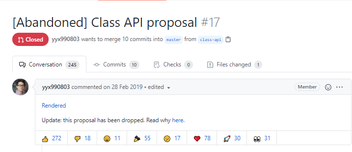
>
> 그리고 Vue3에 추가된 인스턴스 옵션 속성 : setup()
>
> ```js
> setup() {
>   const state = reactive({
>     count: 0
>   })
>   
>   const double = computed(() => state.count * 2)
>   
>   function increment() {
>     state.count++
>   }
>   
>   return {
>     state,
>     double,
>     increment
>   }
> }
> ```

### Vue.js에서 타입스크립트를 적용하는 방법

1. 서비스를 처음 구축할 때 부터 타입스크립트를 사용한다.
2. 기존에 이미 구현된 서비스에 타입스크립트를 점진적으로 적용한다.

## Project1. TO-DO CRUD

**서비스를 처음 구축할 때 부터 타입스크립트를 사용한다.**

> [ts config 파일](https://www.typescriptlang.org/tsconfig/)
>
> `tsconfig.json`
>
> ```json
> {
>   "compilerOptions": {
>     "target": "esnext",
>     "module": "esnext",
>     // strict : true로 하면 noImplicitAny : true로 자동적용
>     "strict": true,
>     "jsx": "preserve",
>     "importHelpers": true,
>     "moduleResolution": "node",
>     "skipLibCheck": true,
>     "esModuleInterop": true,
>     "allowSyntheticDefaultImports": true,
>     "sourceMap": true,
>     "baseUrl": ".",
>     "types": [
>       "webpack-env"
>     ],
>     // jsconfig.json에서(VScode내 설정) 사용했던 절대경로를 tsconfig.json에서(typescript설정) 지정할 수있다
>     "paths": {
>       "@/*": [
>         "src/*"
>       ]
>     },
>     "lib": [
>       "esnext",
>       "dom",
>       "dom.iterable",
>       "scripthost"
>     ]
>   },
>   "include": [
>     "src/**/*.ts",
>     "src/**/*.tsx",
>     "src/**/*.vue",
>     "tests/**/*.ts",
>     "tests/**/*.tsx"
>   ],
>   "exclude": [
>     "node_modules"
>   ]
> }
> ```
>
> - `shims-vue.d.ts`
>   - `.vue` 파일을 모두 Vue타입으로 인식해줘!
>
> ```typescript
> declare module "*.vue" {
>   import Vue from "vue";
>   export default Vue;
> }
> ```

- `App.vue`시작을 할 때 `ts(vbase-ts)`를 선택하면 자동완성으로 vue에서 typescript를 사용할 수 있는 기본 SPA코드가 자동완성됨 

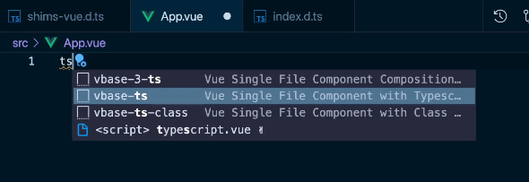

### v-model을 풀어서 구현하는 방식의 장점

> [v-model 글 안내](https://joshua1988.github.io/web-development/vuejs/v-model-usage/)

1. 한국어도 바로바로 적용이 된다
2. 컴포넌트 재사용성이 높아진다
   - 예를들어, TodoInput의 컴포넌트에 `:item="todoText"`와 `@input="updateTodoText"`를 v-model을 풀어서 쓴다면  `:item="password"`와 `@input="updatePassword"` 이렇게 값을 다르게 하면 컴포넌트 활용을 더 잘할 수 있다
3. 그리고 `v-model="todoText"`로도 적용이 가능하다
   - 단, `@input`과 `:value`라고 썼을 때 가능함

### localStorage에 key(vue-todo-ts-v1)와 value(배열)로 저장

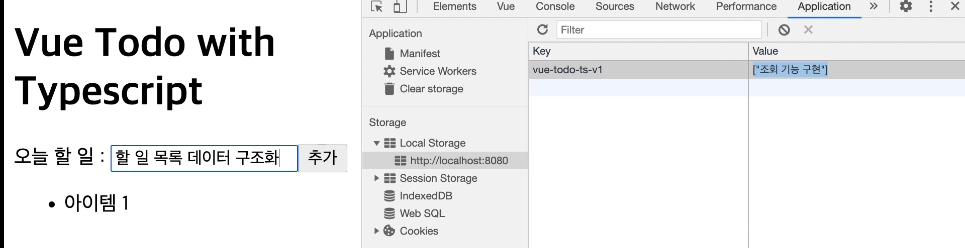

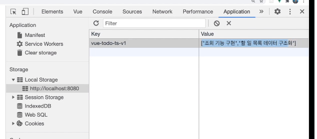

### Vue Todo With Typescript

## 학습한 내용

- Vue + Typescript 프로젝트 생성 방법


- 뷰 타입스크립트 프로젝트 기본 구조
- 재활용성을 고려한 공통 컴포넌트 설계 방법(인풋, 목록 아이템)
  - 인풋 태그의 한글 입력 처리 방법
- `.vue` 파일에서의 타입스크립트 정의 방식
  - `data`
  - `methods`
  - `props`
  - `computed`
- 타입스크립트를 사용했을 때의 이점

- `App.vue`

```vue
<template>
  <div>
    <header>
      <h1>Vue Todo with Typescript</h1>
    </header>
    <main>
      <!-- 아래에서 올라온 input emit이벤트를 받아 updateTodoText 메소드 실행-->
      <TodoInput
        :item="todoText"
        @input="updateTodoText"
        @add="addTodoItem"
      ></TodoInput>
      <div>
        <ul>
          <TodoListItem
            v-for="(todoItem, index) in todoItems"
            :key="index"
            :index="index"
            :todoItem="todoItem"
            @toggle="toggleTodoItemComplete"
            @remove="removeTodoItem"
          ></TodoListItem>
          <!-- <li>아이템 1</li>
          <li>아이템 2</li>
          <li>아이템 3</li> -->
        </ul>
      </div>
    </main>
  </div>
</template>

<script lang="ts">
import Vue from "vue";
import TodoInput from "./components/TodoInput.vue";
import TodoListItem from "./components/TodoListItem.vue";
// Storage key를 key값, todoItem 배열을 value에 저장할거다
const STORAGE_KEY = "vue-todo-ts-v1";
// localStorage api 이용(key(상수):value(배열직렬화))
// STORAGE_KEY값으로 조회, 추가
const storage = {
  // todoItem 저장
  save(todoItems: Todo[]) {
    // stringify : 배열을 받아서 문자열로 바꾸고 그 문자열로 바꾼것을 그대로 setItem에 그대로 넣게된다
    const parsed = JSON.stringify(todoItems);
    localStorage.setItem(STORAGE_KEY, parsed);
  },
  // todo 조회
  // fetch의 결과값이 뭔지 정의해줘야됨(Todo배열)
  fetch(): Todo[] {
    // storage_key로 조회, localstorage에 없다면 빈배열([])을 string으로 ("[]")처리해줌 -> 어차피 JSON.parse에 의해 object로 반환되는데 type때문에  에러가나니 그냥 ""붙여줌
    //  todoItems에 저장하고 있다면 배열을 저장함
    const todoItems = localStorage.getItem(STORAGE_KEY) || "[]";
    // 배열로 된것이 json으로 간주되고 object로 반환됨
    // JSON.parse의 todoItems안의 key value는 모두 ""(큰따옴표)로 돼있어야됨
    const result = JSON.parse(todoItems);
    return result;
  }
};
// Todo 객체를 위한 타입 지정
// export를 해야 다른 파일에서도 Todo를 쓸 수 있다
export interface Todo {
  title: string;
  done: boolean;
}

export default Vue.extend({
  components: { TodoInput, TodoListItem },
  // vda : data()속성 자동완성
  data() {
    return {
      todoText: "",
      // todoItems에 들어오는 값은 Todo들이 객체로 들어온다고 타입단언
      todoItems: [] as Todo[]
    };
  },
  methods: {
    // Input에서 올라온 값이 value(string)로 들어옴
    updateTodoText(value: string) {
      this.todoText = value;
    },
    addTodoItem() {
      const value = this.todoText;
      // 이건 그냥 보여주기위해서 적음 나중엔 바로 push안에 적으면 됨
      const todo: Todo = {
        title: value,
        done: false // 아직완료되지 않았으니까 false
      };
      // localStorage에 배열로 저장할 것이기 떄문에 todo를 배열에 넣은 뒤, 저장
      this.todoItems.push(todo);
      storage.save(this.todoItems);
      // localStorage.setItem(value, value);
      this.initTodoText();
    },
    initTodoText() {
      this.todoText = "";
    },
    // items 조회
    fetchTodoItems() {
      // this.todoItems = 1;
      // storage의 fetch로 배열을 가져옴
      // storage.fetch()의 타입을 알기 때문에 a,b의 type을 따로 지정해주지 않아도 됨(타입추론)
      this.todoItems = storage.fetch().sort((a, b) => {
        // sort api 
        // 정렬할 대상은 title(유니코드순)
        // a가 b보다 작을 때 -1
        if (a.title < b.title) {
          return -1;
        }
        // a가 b보다 크면 1
        if (a.title > b.title) {
          return 1;
        }
        // 아니면 0
        return 0;
      });
      return "hi";
    },
    // index를 emit으로 보냄
    removeTodoItem(index: number) {
      console.log("remove", index);
      // index에서 1개를 지우겠다
      this.todoItems.splice(index, 1);
      // 배열이 삭제됐으니 업데이트(다시 저장해줌)
      storage.save(this.todoItems);
    },
    // emit으로 todoItem과 index가 넘어옴
    toggleTodoItemComplete(todoItem: Todo, index: number) {
      this.todoItems.splice(index, 1, {
        // index에 1개를 todoItem에서 done만 toggle(... : spread operator)
        ...todoItem,
        done: !todoItem.done
      });
      // 수정했으니 저장
      storage.save(this.todoItems);
    }
  },
  created() {
    this.fetchTodoItems();
  }
});
</script>

<style scoped></style>
```

- `TodoInput.vue`

```vue
<template>
  <div>
    <label for="todo-input">오늘 할 일 : </label>
    <!-- @input은 키보드의 input이벤트 -->
    <input id="todo-input" type="text" :value="item" @input="handleInput" />
    <!-- type="button"은 접근성(?)때문에 적음 -->
    <button @click="addTodo" type="button">추가</button>
    
  </div>
</template>

<script lang="ts">
import Vue from "vue";

export default Vue.extend({
  // props: ["item"],
  props: {
    // item이란 type을 정의해줘야됨
    item: {
      type: String,
      // 값은 무조건 있어야됨(필수값)
      required: true
    }
  },
  methods: {
    // input이벤트가 왔을때 App.vue에 emit으로 알려줌
    // event의 InputEvent로 어떻게 추론되는가? 
    handleInput(event: InputEvent) {
      // console.log(event); // target:input인것을 알 수 있다
      // 단언 null이 아니란 것을 알려줘야된다
      // 1) event.target!.value
      // 2) 1)보다 더 safe한 방법
      // if (!event.target) {
      //   return;
      // }
      // 3) 2)를 해도 에러가 난다=> as로 타입단언해주는게 제일 편한 방법(unsafe한 방법이긴하다..)
      const eventTarget = event.target as HTMLInputElement;
      // "input" emit event은 컴포넌트가 대화하기위한 수단
      this.$emit("input", eventTarget.value);
    },
    addTodo() {
      // add emit event올라감
      this.$emit("add");
    }
  }
});
</script>

<style scoped></style>

```

- `TodoListItem.vue`

```vue
<template>
  <li>
    <span class="item" :class="todoItemClass" @click="toggleItem">{{
      todoItem.title
    }}</span>
    <!-- @click="$emit('remove')" 이렇게 바로 emit을 날릴 수 있음 => but 나중에 test할 때 힘듦, 가급적이면 아래 methods에 작성 -->
    <button @click="removeItem">삭제</button>
  </li>
</template>

<script lang="ts">
// Todo interface를 가져와 쓸수 있다
import { Todo } from "@/App.vue";
import Vue, { PropType } from "vue";

export default Vue.extend({
  props: {
    // vue 내부적으로 PropType이란것을 제공함 이건 제너릭을 받기 때문에 원하는 타입을 넘겨줄 수 있다
    todoItem: Object as PropType<Todo>,
    index: Number
  },

  computed: {
    // class가 복잡해졌을때 computed로 만듦(template의 표현식을 단순하게 만들기 위해)
    // computed는 return있기 때문에 반환타입을 적어줘야됨
    // class 반환타입은 string("complete")이거나 null(null)이다
    todoItemClass(): string | null {
      return this.todoItem.done ? "complete" : null;
    }
  },

  methods: {
    toggleItem() {
      this.$emit("toggle", this.todoItem, this.index);
    },
    removeItem() {
      // 몇번째 index인지 가져와서 그걸 토대로 없앰
      this.$emit("remove", this.index);
    }
  }
});
</script>

<style scoped>
.item {
  cursor: pointer;
}
.complete {
  text-decoration: line-through;
}
</style>

```


## Project2. vue-news

**기존에 이미 구현된 서비스에 타입스크립트를 점진적으로 적용한다.**

> ### 뷰 프로젝트에 타입스크립트를 점진적으로 적용하는 방법
>
> 1. Vue + Typescript 프로젝트 생성
>
> 2. 기존 서비스 코드와 라이브러리를 새 프로젝트에 이동
>
> 3. 기본적인 빌드 에러 해결
>
> 4. 타입스크립트의 혜택을 볼 수 있는 주요 파일들 위주로 `.js` -> `.ts`로 변환하며 적용
>
> ***팁 : 타입 체킹 정도는 덜 엄격한 방식에서 점점 엄격한 방식으로 적용하는 것을 추천***

1. `typescript`추가 -> **이러면 에러가 엄청남 이렇게 하지말고 vue cli를 만들고, 원래의 코드를 복붙해오며 점진적으로 바꿈!**

```bash
$ vue add typescript
? Still proceed? Yes
? Use class-style component syntax? No
? Use Babel ~? Yes
? Convert all .js files to .ts? No #모든 js를 ts로 바꾸면 에러가 너무 많이 남 점진적으로 바꿔야됨
? Allow .js files to be compiled? Yes
? Skip type checking of all declaration files? Yes

```

1. vue create

```bash
$ vue create vue-news
```


2. 폴더 복사해서 `src`폴더에 옮기기

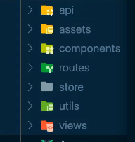

3. `App.vue` 그대로 복붙, `main.js` -> `main.ts`에 복붙, `index.html`복붙

4. `pacakge.json`의 필요한 라이브러리 설치

```bash
$ npm install axios vuex vue-router
```

5. `npm run serve` 와 `npm run build`를 해봄 -> 에러 고쳐나감

6. 점진적으로 바꾸기 위해 `tsconfig.json`의 `strict:false`로 두고 에러를 고쳐나감

7. router 에러를 해결하기 위해 일단  `tsconfig.json`의 `allowJS:true`로 둠
8. 이러면 `npm run serve`에서는 에러가안남
9. `npm run build`를 함 ->  서버에서는 안나지만 build에서는 날 수 있다 -> build에서도 에러가 안나는 것 확인
10. 이제 바꿔나가기 시작함

### App.vue에 타입스크립트 적용 및 strict 옵션 참고 사항

> script만 바꿔주기 위해 `ts`후 `<script> typescript.vue`를 선택

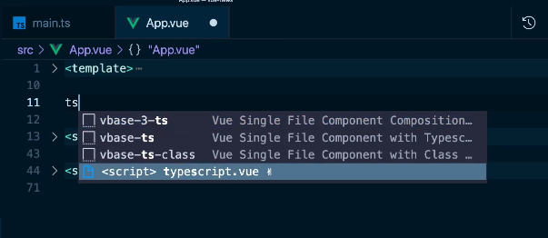

1. strict옵션 하나를 올림 -> `tsconfig.json`파일의 `"noImplicitAny" : true`로 줌(`strict:false`)
2. 서버를 껐다 킴 -> 에러를 고쳐나감

### 유틸성 파일에 TS 적용

1. `utils`폴더의 `bus.js` -> `bus.ts`로 바꿈
2. `bus.js`라고 돼있는 것을 `import bus from "./utils/bus";`로 수정
3. 아래 vs코드 기능으로 다 바꿀수 있음

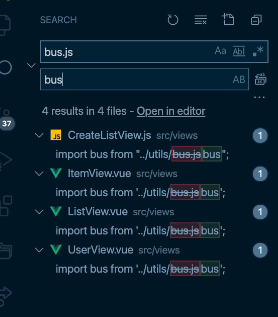

### 주요 TS 적용 

> 에러때문에 화면이 안나오는 것 처리
>
> `vue.config.js`
>
> ```js
> module.exports = {
>   devServer: {
>     overlay: false
>   }
> };
> 
> ```

#### 라우터 파일에 TS 적용 및 라이브러리 내부 타입 선언 파일 설명

1. `index.js`를 `index.ts`로 바꿈 ->  다른 js파일도 차근차근 ts로 바꾸고 에러처리

2. 에러에 마우스올리면 어떻게 고쳐야되는지 나옴 차근차근 고쳐나가면된다

**(참고) strict옵션 true로 바꾼 뒤 error 고쳐나감**

#### 스토어 상태 관리에 대한 주의 사항 안내

> 굳이 스토어를 안써도 되는상황이면 컴포넌트내에서 처리를 해야됨! 스토어에 쓰는게 더 비용낭비!
>
> 예를들어 `Listview`에서 
>
> 1) props로 ListItem으로 넘겨주면 되는 상황이면 store에 안쓰는게 맞고, 
>
> 2) 페이지에 들어가기전에 데이터를 준비하고 싶다면 store에 저장하는게 맞음, 만약 그게아니라면 컴포넌트에서 바로 적어줘야됨!

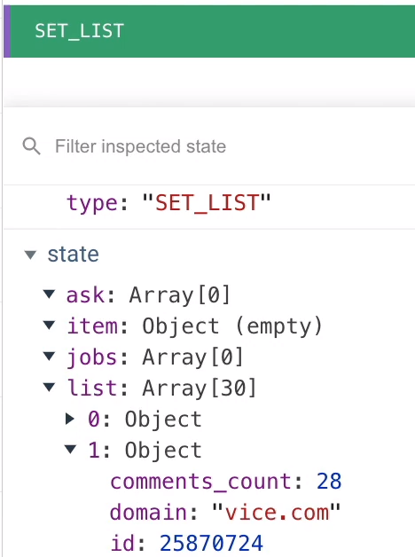

#### 스토어 타입 추론이 안되는 이유?

`$ store`에 `alt`로 자세히 라이브러리로 들어가게 되면 `node_modules/vuex/types/vue.d.ts`에서 보면 **declaration merging(선언병합)** 두번 interface를 쓰게되면 합쳐짐

> ##### [Declaration Merging](https://www.typescriptlang.org/ko/docs/handbook/declaration-merging.html)
>
> “선언 병합”은 컴파일러가 같은 이름으로 선언된 개별적인 선언 두 개를 하나의 정의로 합치는 것을 의미한다. 이 병합된 정의는 원래 두 선언의 특성을 모두 갖는다. 병합할 선언이 몇 개든 병합할 수 있습니다; 두 개의 선언만 합치도록 제한하지 않는다.
>
> ###### 기본 사용법 (Basic Concepts)
>
> TypeScript에서, 선언은 네임스페이스, 타입 또는 값 3개의 그룹 중 적어도 하나의 엔티티를 생성한다. 네임스페이스-생성 선언은 점 표기법을 사용하여 접근할 이름을 가진 네임 스페이스를 생성한다. 타입-생성 선언은 주어진 이름에 바인딩 되고 선언된 형태로 표시된 타입을 생성한다. 마지막으로, 값-생성 선언은 JavaScript에서 확인할 수 있는 출력값을 생성한다.
>
> | 선언 타입     | 네임 스페이스 | 타입 | 값   |
> | :------------ | :------------ | :--- | :--- |
> | 네임 스페이스 | X             |      | X    |
> | 클래스        |               | X    | X    |
> | 열거형        |               | X    | X    |
> | 인터페이스    |               | X    |      |
> | 타입 별칭     |               | X    |      |
> | 함수          |               |      | X    |
> | 변수          |               |      | X    |
>
> 각 선언으로 생성된 결과를 이해하는 것은 선언 병합을 할 때 병합된 결과물을 이해하는 데 도움이 된다.
>
> ###### 인터페이스 병합 (Merging Interfaces)
>
> 가장 단순하고 일반적인 선언 병합의 타입은 인터페이스 병합이다. 가장 기본적인 수준에서, 병합은 두 선언의 멤버를 같은 이름의 단일 인터페이스로 기계적으로 결합한다.
>
> ```typescript
> interface Box {
>   height: number;
>   width: number;
> }
> interface Box {
>   scale: number;
> }
> let box: Box = { height: 5, width: 6, scale: 10 };
> ```
>
> 인터페이스의 비-함수 멤버는 고유해야 한다. 만약 고유하지 않으면, 모두 같은 타입이어야 한다. 인터페이스가 동일한 이름의 함수 멤버를 선언하지만 다른 타입으로 선언하는 경우 컴파일러는 error를 발생시킨다.
>
> 함수 멤버의 경우, 이름이 같은 각 함수 멤버는 같은 함수의 오버로드 하는 것으로 처리한다. 또한 중요한 것은 인터페이스 A와 이후 인터페이스 A를 병합하는 경우에, 두 번째 인터페이스가 첫 번째 인터페이스보다 더 높은 우선순위를 갖게 된다.
>
> 예를 들어:
>
> ```typescript
> interface Cloner {
>   clone(animal: Animal): Animal;
> }
> 
> interface Cloner {
>   clone(animal: Sheep): Sheep;
> }
> 
> interface Cloner {
>   clone(animal: Dog): Dog;
>   clone(animal: Cat): Cat;
> }
> ```
>
> 위의 세 인터페이스를 아래와 같은 단일 선언으로 병합할 수 있다:
>
> ```type
> interface Cloner {
>   clone(animal: Dog): Dog;
>   clone(animal: Cat): Cat;
>   clone(animal: Sheep): Sheep;
>   clone(animal: Animal): Animal;
> }
> ```
>
> 각 그룹의 요소는 동일한 순서를 유지하지만, 그룹 자체는 나중에 오버로드 될수록 첫 번째에 위치하는 것에 유의.
>
> 이 규칙엔 특수 시그니처(specialized signatures)라는 예외가 존재한다. 만약 단일 문자열 리터럴 타입(예. 문자열 리터럴이 유니온이 아닌 경우)인 매개변수가 있을 경우, 시그니처는 병합된 오버로드 목록의 맨 위로 올라오게 된다.
>
> 예를 들어, 아래의 인터페이스들이 병합된다:
>
> ```typescript
> interface Document {
>   createElement(tagName: any): Element;
> }
> interface Document {
>   createElement(tagName: "div"): HTMLDivElement;
>   createElement(tagName: "span"): HTMLSpanElement;
> }
> interface Document {
>   createElement(tagName: string): HTMLElement;
>   createElement(tagName: "canvas"): HTMLCanvasElement;
> }
> ```
>
> `Document`의 병합된 선언 결과는 다음과 같다:
>
> ```typescript
> interface Document {
>   createElement(tagName: "canvas"): HTMLCanvasElement;
>   createElement(tagName: "div"): HTMLDivElement;
>   createElement(tagName: "span"): HTMLSpanElement;
>   createElement(tagName: string): HTMLElement;
>   createElement(tagName: any): Element;
> }
> ```
>
> ###### 네임스페이스 병합 (Merging Namespaces)
>
> 인터페이스와 마찬가지로 같은 이름의 네임스페이스는 네임스페이스 멤버와 병합한다. 네임스페이스가 네임스페이스와 값 둘 다 만들기 때문에, 두 가지가 병합되는 방법을 이해야된다.
>
> 네임스페이스를 병합하기 위해서, 각 네임스페이스에 선언된 export 된 인터페이스로부터 타입 정의가 병합되며, 내부에 병합된 인터페이스 정의가 있는 단일 네임스페이스가 형성된다.
>
> 네임스페이스 값을 병합하려면, 각 선언 위치에 이미 지정된 이름의 네임스페이스가 있을 경우에, 기존 네임스페이스에 두 번째 네임스페이스의 export 된 멤버를 첫 번째에 추가하여 네임스페이스 값이 확장된다.
>
> 이러한 예제인 `Animals` 의 선언 병합:
>
> ```typescript
> namespace Animals {
>   export class Zebra {}
> }
> 
> namespace Animals {
>   export interface Legged {
>     numberOfLegs: number;
>   }
>   export class Dog {}
> }
> ```
>
> 다음과 같다:
>
> ```typescript
> namespace Animals {
>   export interface Legged {
>     numberOfLegs: number;
>   }
> 
>   export class Zebra {}
>   export class Dog {}
> }
> ```
>
> 이러한 네임스페이스 병합의 모델은 좋은 출발점이지만, 우리는 export 되지 않은 멤버에게 어떤 일이 발생하는지 이해해야 한다. export 되지 않은 멤버는 원래 네임스페이스(병합되지 않은 네임스페이스)에서만 볼 수 있다. 이는 병합 후에 다른 선언으로 병합된 멤버는 export 되지 않은 멤버를 볼 수 없다는 것을 의미힌다.
>
> 아래의 예제에서 더 명확하게 확인할 수 있다:
>
> ```typescript
> namespace Animal {
>   let haveMuscles = true;
> 
>   export function animalsHaveMuscles() {
>     return haveMuscles;
>   }
> }
> 
> namespace Animal {
>   export function doAnimalsHaveMuscles() {
>     return haveMuscles; // 오류, haveMuscles가 여기에 접근할 수 없기 때문에
>   }
> }
> ```
>
> `haveMuscles` 가 export 되지 않아서, 동일하게 병합되지 않은 네임스페이스를 공유하는 `animalsHaveMuscles` 함수만 이 심벌을 볼 수 있다. `doAnimalsHaveMuscles` 함수가, 병합된 `Animal` 네임스페이스의 멤버일지라도, export 되지 않은 멤버는 볼 수 없다.
>
> ###### 클래스, 함수, 열거형과 네임 스페이스 병합 (Merging Namespaces with Classes, Functions, and Enums)
>
> 네임 스페이스는 다른 타입의 선언과 병합할 수 있을 정도로 유연하다. 이를 위해서, 네임 스페이스 선언은 병합할 선언을 따라야 힌다. 결과 선언은 두 선언 타입의 프로퍼티를 모두 갖는다. TypeScript는 이를 통해 JavaScript와 다른 프로그래밍 언어에서의 패턴을 모델링 힌다.
>
> ###### 네임 스페이스와 클래스 병합 (Merging Namespaces with Classes)
>
> 이 부분은 내부 클래스를 설명하는 방법을 말힌다.
>
> ```typescript
> class Album {
>   label: Album.AlbumLabel;
> }
> namespace Album {
>   export class AlbumLabel {}
> }
> ```
>
> 병합된 멤버의 가시성 규칙은 [Merging Namespaces](https://www.typescriptlang.org/ko/docs/handbook/declaration-merging.html#merging-namespaces) 세션에서 설명한 것과 같으므로, `AlbumLabel`클래스를 export해야 병합된 클래스를 볼 수 있습니다. 최종 결과는 다른 클래스 내에서 관리되는 클래스다. 또한 네임 스페이스를 사용하여 기존 클래스에 더 많은 정적 멤버를 추가할 수도 있다.
>
> 내부 클래스 패턴 이외에도, JavaScript에서 함수를 생성하고 프로퍼티를 추가함으로써 함수를 확장하는 것에도 익숙할 것이다. TypeScript는 선언 병합을 통해 타입을 안전하게 보존하며 정의할 수 있다.
>
> ```typescript
> function buildLabel(name: string): string {
>   return buildLabel.prefix + name + buildLabel.suffix;
> }
> 
> namespace buildLabel {
>   export let suffix = "";
>   export let prefix = "Hello, ";
> }
> 
> console.log(buildLabel("Sam Smith"));
> ```
>
> 마찬가지로 네임스페이스는 정적 멤버의 열거형을 확장할 수 있다:
>
> ```typescript
> enum Color {
>   red = 1,
>   green = 2,
>   blue = 4,
> }
> 
> namespace Color {
>   export function mixColor(colorName: string) {
>     if (colorName == "yellow") {
>       return Color.red + Color.green;
>     } else if (colorName == "white") {
>       return Color.red + Color.green + Color.blue;
>     } else if (colorName == "magenta") {
>       return Color.red + Color.blue;
>     } else if (colorName == "cyan") {
>       return Color.green + Color.blue;
>     }
>   }
> }
> ```
>
> ###### 허용되지 않은 병합 (Disallowed Merges)
>
> TypeScript에서 모든 병합이 허용되는 것은 아니다. 클래스는 다른 클래스나 변수와 병합할 수 없다. 클래스 병합을 대체하는 것에 대한 정보는 [Mixins in TypeScript](https://www.typescriptlang.org/docs/handbook/mixins.html) 섹션에서 볼 수 있다.
>
> ###### 모듈 보강 (Module Augmentation)
>
> JavaScript는 모듈 병합을 지원하지 않지만 기존 객체를 import 하고 업데이트함으로써 패치할 수 있다. 쉬운 Observable 예를 살펴보겠다:
>
> ```typescript
> // observable.ts
> export class Observable<T> {
>   // ... 연습을 위해 남겨둠 ...
> }
> 
> // map.ts
> import { Observable } from "./observable";
> Observable.prototype.map = function (f) {
>   // ... 연습을 위해 남겨둠
> };
> ```
>
> 이는 TypeScript에서 잘 동작하지만, 컴파일러는 `Observable.prototype.map`에 대해 알지 못한다. 모듈 보강을 통해 컴파일러에게 정보를 알려줄 수 있다:
>
> ```typescript
> // observable.ts
> export class Observable<T> {
>   // ... 연습을 위해 남겨둠 ...
> }
> 
> // map.ts
> import { Observable } from "./observable";
> declare module "./observable" {
>   interface Observable<T> {
>     map<U>(f: (x: T) => U): Observable<U>;
>   }
> }
> Observable.prototype.map = function (f) {
>   // ... 연습을 위해 남겨둠
> };
> 
> // consumer.ts
> import { Observable } from "./observable";
> import "./map";
> let o: Observable<number>;
> o.map((x) => x.toFixed());
> ```
>
> 모듈 이름은 `import`/`export`의 모듈 지정자와 같은 방법으로 해석된다. 자세한 내용은 [모듈](https://www.typescriptlang.org/docs/handbook/modules.html)을 참고. 그다음 보강된 선언은 마치 원본과 같은 파일에서 선언된 것처럼 병합된다.
>
> 그러나, 두 가지 제한 사항을 명심해라:
>
> 1. 보강에 새로운 최상위 선언을 할 수 없다 — 기존 선언에 대한 패치만 가능하다.
> 2. Default exports는 보강할 수 없으며, 이름을 갖는 export만 보강할 수 있다(해당 이름으로 확장시켜야 하며, `default`는 예약어다 - 자세한 내용은 [#14080](https://github.com/Microsoft/TypeScript/issues/14080)을 참고)
>
> ###### 전역 보강 (Global augmentation)
>
> 모듈 내부에서 전역 스코프에 선언을 추가할 수 있다:
>
> ```typescript
> // observable.ts
> export class Observable<T> {
>   // ... 연습을 위해 남겨둠 ...
> }
> 
> declare global {
>   interface Array<T> {
>     toObservable(): Observable<T>;
>   }
> }
> 
> Array.prototype.toObservable = function () {
>   // ...
> };
> ```
>
> 전역 보강은 모듈 보강과 동일한 동작과 한계를 가지고 있다.

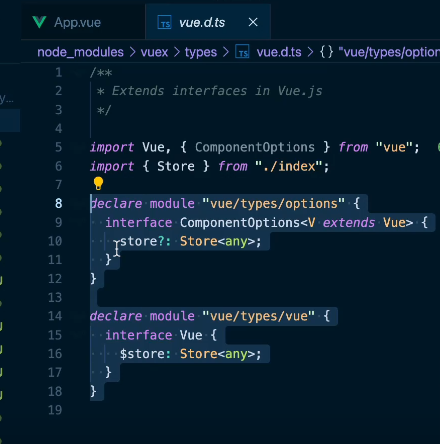

**Store에 any라는 타입을 기준으로 추론이됨 => **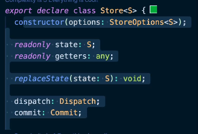

예를들어 이렇게 S에 any가 들어가면서 다 any로 추론이 된다


#### API 파일에 타입스크립트 적용 및 호출 로직 구현

1. `api`의 `index.js -> index.ts`

**(참고) api 반환값 AxiosResponse보다 AxiosPromise를 실무에서 더 자주 쓴다** => WHY? 제네릭을 더 줄일 수 있기 때문

(참고) computed속성 활용 이유 => 오타, debugging을 쉽게 하기 위해..